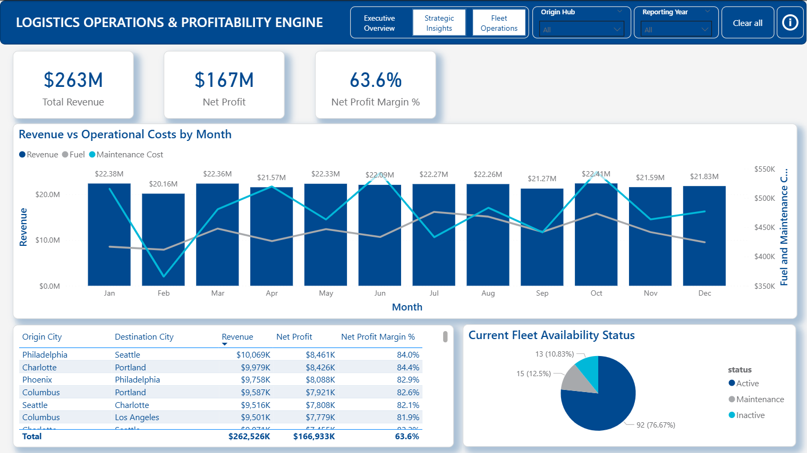
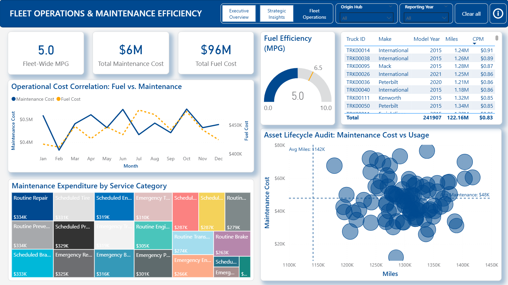
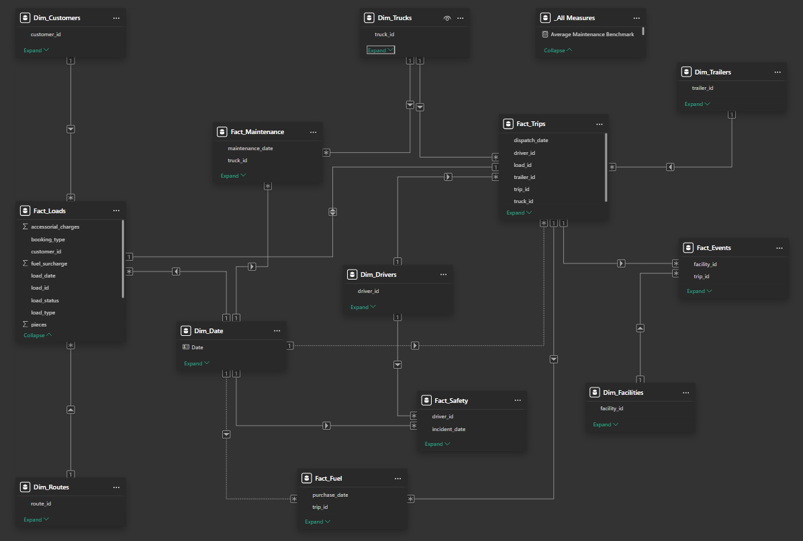

# Logistics & Fleet Operations Intelligence Suite

## Project Overview
The **Logistics & Fleet Operations Intelligence Suite** is an end-to-end Power BI solution designed to optimize the *middle mile* for logistics providers.  
It integrates **17 operational data streams** to deliver a unified view of **revenue, fuel, maintenance, and asset performance**, enabling data-driven decisions across fleet operations and commercial strategy.

This solution supports:
- Fleet health monitoring and asset lifecycle decisions
- Route and customer profitability analysis
- Fuel efficiency and maintenance cost optimization

---

## Report Preview

### Executive Overview

### Strategic Insights

### Fleet Operations & Maintenance

### Data Model

---

## Business Use Cases
- **Asset Retirement & Replacement**  
  Identify high-cost, low-utilization trucks using maintenance vs. mileage analysis.
- **Customer & Route Strategy**  
  Detect low-margin, high-volume customers and underperforming routes for contract renegotiation.
- **Operational Efficiency**  
  Track MPG, cost per mile (CPM), and revenue per mile (RPM) to improve fuel strategy and driver performance.

---

## Technical Architecture
- **Star Schema Data Model**  
  A high-performance analytical model consisting of **6 Fact tables** and **11 Dimension tables**.
- **Portable Power Query (M)**  
  Fully parameter-driven folder ingestion using a centralized `Staging_Folder` parameter, making the report environment-agnostic.
- **Advanced DAX Modeling**  
  Centralized measure catalog with dynamic benchmarking and fleet-wide comparative metrics.
- **Measure Transparency**  
  Core business measures are documented in a dedicated  
  ➜ **[DAX Measure Catalog](./DAX/Measure_Catalog.md)**

---

## Measure Catalog Overview

### 01. Financial KPIs
- **Total Revenue**  
  Gross earnings derived from operational load data.
- **Net Profit & Net Profit Margin %**  
  Bottom-line performance after fuel and maintenance costs.
- **Total Fuel Cost & Total Maintenance Cost**  
  Granular expense tracking across assets and time.

### 02. Operational Efficiency Metrics
- **Fuel Efficiency (MPG)**  
  Identification of underperforming vehicles.
- **Cost per Mile (CPM)**  
  Core metric for fleet cost control and asset comparison.
- **Revenue per Mile (RPM)**  
  Commercial efficiency indicator for routes and customers.

### 03. Dynamic Benchmarks
- **Fleet Averages (Profit, MPG, Miles, Maintenance Cost)**  
  Used as real-time benchmarks to highlight outlier trucks, drivers, and routes.

---

## Repository Structure

/Data → Synthetic operational datasets (CSV)  
/Power Query → Modular Power Query (.m) scripts  
/DAX → Centralized DAX measure documentation  
/Visuals → Report screenshots (pages & data model)  
/PBIX → Power BI report file  
README.md

---

## Setup Instructions
1. Download the `Data` folder from this repository.
2. Open the Power BI `.pbix` file.
3. In Power Query, update the **`Staging_Folder` parameter** to point to your local `Data` folder.
4. Refresh the model.

---

## Key Outcomes
- Improved visibility into **true operational profitability**
- Faster identification of **cost outliers and inefficiencies**
- Actionable insights for **fleet, finance, and commercial stakeholders**

---

## Tools & Technologies
- **Power BI Desktop**
- **Power Query (M)**
- **DAX**
- **Star Schema Modeling**
- **Synthetic, production-like datasets**

